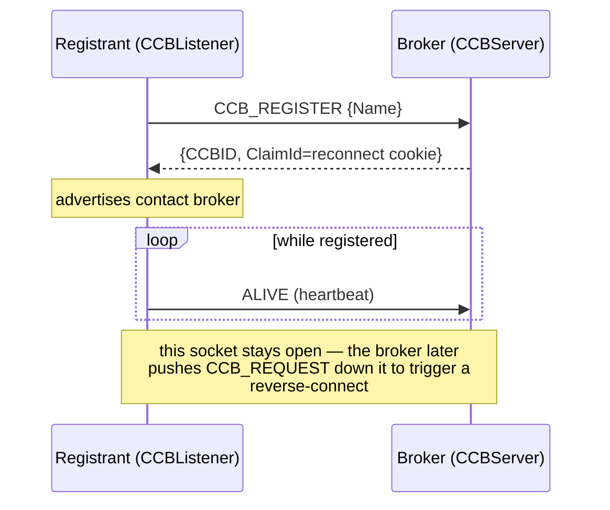
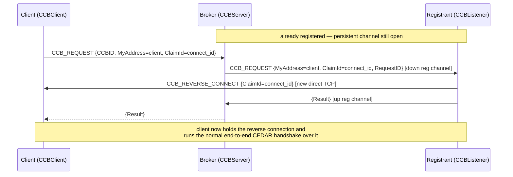
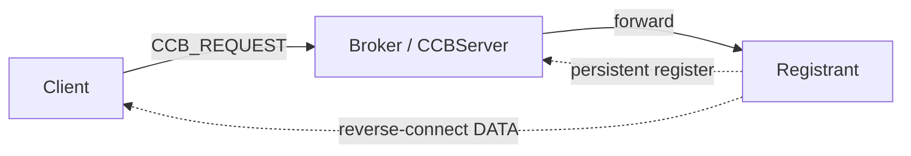
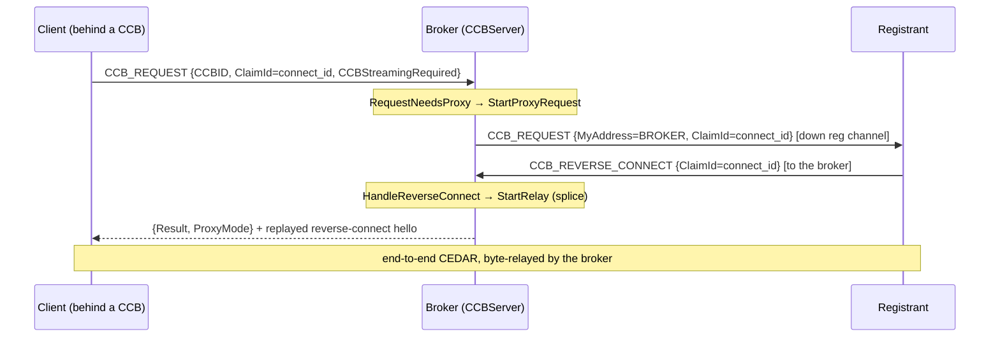
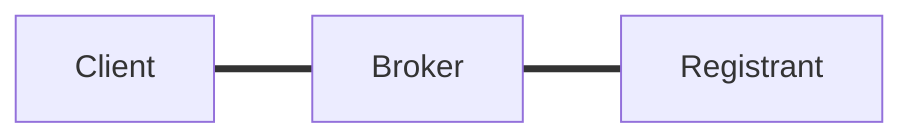
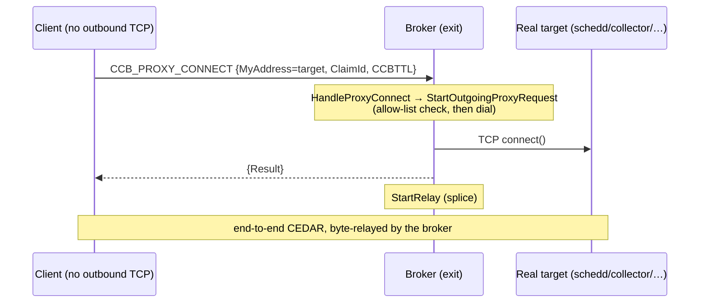
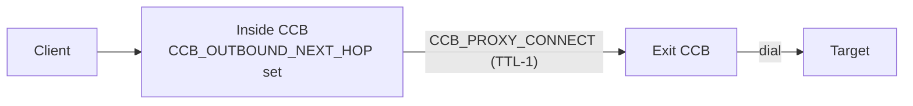
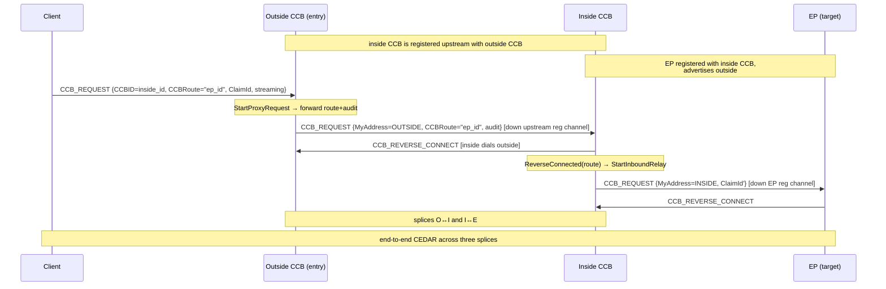
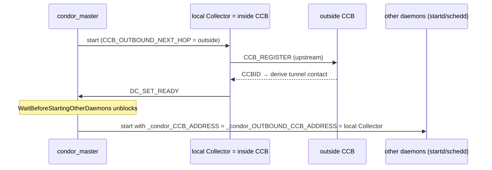

# The Condor Connection Broker (CCB)

This document is an architectural overview of the Condor Connection Broker. It is
written to give developers the mental model needed to read the code in this
directory — `ccb_server.cpp`, `ccb_listener.cpp`, and `ccb_client.cpp` — plus the
outbound/tunneling extensions that layer on top of it.

---

## 1. Problem Statement

HTCondor is peer-to-peer: to run a job, a schedd connects to a startd, a shadow
connects to a starter, tools connect to daemons, etc. That breaks when a daemon
lives behind a firewall or NAT that blocks *inbound* TCP — the daemon can dial
out, but nobody can dial *in* to it.

CCB inverts the unreachable connection through connection reversal. A daemon that
cannot accept inbound connections instead keeps a **persistent outbound connection
open to a broker** (its "CCB server"). When someone wants to reach that daemon,
they ask the broker, and the broker tells the daemon — over the connection it
already holds open — to **reverse-connect** back to the requester. The direction
of the TCP `connect()` is flipped; the direction of the logical HTCondor
conversation is not.

Everything else in this document is a variation on that one idea: *a broker uses
a connection a daemon already holds open to arrange a connection the daemon could
not otherwise accept.*

---

## 2. Terminology and roles

CCB has three participants. Keep them straight — the same physical daemon often
plays several of these roles at once.

| Role | Class | Who plays it | Responsibility |
|------|-------|--------------|----------------|
| **CCB server** (broker) | `CCBServer` | usually the *condor_collector* | Accepts registrations, matches requests to registrants, brokers/relays connections. |
| **CCB listener** (registrant / *target*) | `CCBListener`, `CCBListeners` | any daemon behind a firewall (startd, schedd, …) | Registers with a broker and keeps the connection open; reverse-connects on demand. |
| **CCB client** (requester) | `CCBClient` | anyone initiating a connection to a registrant | Asks the broker to arrange the connection; accepts (or is spliced into) the result. |

Supporting concepts and their code counterparts:

- **CCBID** (`CCBID`, an `unsigned long`) — the broker's local handle for one
  registrant. Assigned in `HandleRegistration`.  Considered public information.
- **CCB contact string** — what a registrant advertises so others can reach it:
  `<broker-sinful>#<ccbid>`. Built by `CCBServer::CCBIDToContactString` and parsed
  back on the client via `CCBClient::SplitCCBContact`. A `Sinful` may carry a CCB
  contact, and that contact's broker address may itself be CCB-routed — that
  nesting is what tunneling (§7) exploits.
- **connect id** — a per-request secret (carried in `ATTR_CLAIM_ID`, so CEDAR
  treats it as a secret on the wire). The requester generates it; the registrant
  must present it when it reverse-connects, so the requester can confirm the
  inbound connection is the one it asked for and not an impostor.
- **`CCBTarget`** — the broker's server-side object for a registered daemon
  (its socket, CCBID, reconnect cookie).
- **`CCBServerRequest`** — an in-flight request the broker is matchmaking.
- **`CCBProxySession`** — a broker-mediated byte relay (streaming/outbound/tunnel
  modes); holds the two sockets being spliced. See `StartRelay`.

---

## 3. The command vocabulary

CCB adds a small set of DaemonCore commands (`condor_commands.h`). Both request
and response are ClassAds (`condor_attributes.h`) unless noted.

| Command | Authz | Direction | Purpose |
|---------|-------|-----------|---------|
| `CCB_REGISTER` | `DAEMON` | listener → server | Open/refresh the persistent registration; get a CCBID. |
| `CCB_REQUEST` | `READ` | client → server | "Arrange a connection to CCBID X." Also the message the server pushes down the registration channel to trigger a reverse-connect. |
| `CCB_REVERSE_CONNECT` | `ALLOW` (raw) | listener → requester *or* listener → broker | The reverse connection itself. Raw (no security handshake); authenticated by the secret connect id, exactly as the client validates on its end. |
| `CCB_PROXY_CONNECT` | `DAEMON` | client → server | Outbound mode: "dial this target *address* on my behalf and splice." (§6) |
| `DC_SET_READY` | (parent) | daemon → master | Readiness signal the master waits on before starting dependent daemons. (§8) |

Commands are registered in `CCBServer::RegisterHandlers`. `CCB_REVERSE_CONNECT` and
`CCB_PROXY_CONNECT` are registered *conditionally*, depending on configuration
(streaming enabled, outbound-proxy/tunneling enabled).

Common ClassAd attributes on these messages:

| Attribute | Code Macro | Meaning |
|-----------|------------|---------|
| `Command` | `ATTR_COMMAND` | which CCB command a message carries |
| `CCBID` | `ATTR_CCBID` | target registrant (request) / assigned id (register reply) |
| `MyAddress` | `ATTR_MY_ADDRESS` | address to connect to (semantics depend on mode) |
| `ClaimId` | `ATTR_CLAIM_ID` | the connect id / reconnect cookie (a secret) |
| `RequestID` | `ATTR_REQUEST_ID` | correlates a forwarded request with its reply |
| `Result` / `ErrorString` | `ATTR_RESULT` / `ATTR_ERROR_STRING` | outcome of a request |
| `CCBStreamingRequired` | — | client cannot accept a direct reverse-connect; broker must splice |
| `ProxyMode` | — | broker's reply telling the client "this socket is now the relay" |

Tunneling mode adds `CCBRoute` (`ATTR_CCB_ROUTE`), `CCBOriginalRequester`
(`ATTR_CCB_ORIGINAL_REQUESTER`), `CCBPriorHop` (`ATTR_CCB_PRIOR_HOP`),
`CCBTTL` (`ATTR_CCB_TTL`), and `CCBAddress` (`ATTR_CCB_ADDRESS`); see §6–§8.

---

## 4. The registration channel

Each registrant manages one long-lived TCP connection to the broker, opened by
`CCBListener::RegisterWithCCBServer` and accepted by `CCBServer::HandleRegistration`.

- The listener sends `CCB_REGISTER` (with `ATTR_NAME` for debugging; on
  reconnect, its previous `ATTR_CCBID` + reconnect cookie in `ATTR_CLAIM_ID`).
  The server replies with the assigned `ATTR_CCBID` and a fresh reconnect cookie.
  Reply handling: `CCBListener::HandleCCBRegistrationReply`.
- The listener keeps the socket open and heartbeats it (`ALIVE`, driven by
  `CCBListener::HeartbeatTime` / `RescheduleHeartbeat`); the server reaps
  registrants whose sockets go quiet.
- The **server pushes requests down this same socket**: to trigger a
  reverse-connect it writes a `CCB_REQUEST` ClassAd to the target's socket
  (`ForwardRequestToTarget` or `StartProxyRequest`). The listener reads it in
  `ReadMsgFromCCB` → `HandleCCBRequest`.
- `CCBListeners` (plural) manages the set: `Configure` splits the
  space-separated `CCB_ADDRESS` list into one `CCBListener` each;
  `GetCCBContactString` space-joins their contacts into the daemon's advertised
  address.

---

## 5. Mode: traditional CCB

The classic case: the **registrant** is unreachable, but the **client** can
accept inbound connections. The broker plays pure matchmaker — it never touches
the data; the registrant dials the client directly.

When a request arrives, the broker looks up the named registrant and — because
the client can accept a direct connection — pushes the request down that
registrant's open registration channel, carrying the client's address and the
per-request *connect id* (a secret). The registrant dials the client and presents
the connect id; the client recognizes it and adopts the new socket as its
connection to the registrant. The registrant reports success back up the channel,
and the broker relays that to the client. The data path is registrant→client; the
broker stays in the control path only.

Topology — the data connection (dashed) is registrant→client; the broker is only
in the control path:

**Code.**

| Step | Where |
|------|-------|
| Receive the request; look up the registrant | `HandleRequest` → `GetTarget` (a `CCBTarget`) |
| Decide no proxy is needed | `RequestNeedsProxy` → false |
| Push it down the registration channel (client address + connect id) | `ForwardRequestToTarget` |
| Registrant dials the client, presents the connect id | `HandleCCBRequest` → `DoReversedCCBConnect` |
| Client matches the connect id, adopts the socket | `CCBClient::ReverseConnect` |
| Registrant reports the result; broker relays it | `ReportReverseConnectResult` → `RequestReply` |

Messages: `CCB_REQUEST` (client→broker, broker→registrant), `CCB_REVERSE_CONNECT`
(registrant→client). The connect id travels in `ATTR_CLAIM_ID`, the client address
in `ATTR_MY_ADDRESS`.

---

## 6. Mode: streaming

Traditional CCB fails when the **client is also behind a CCB** — the registrant
can't dial the client either. The client asks for streaming, and the broker
splices the two connections instead of stepping out of the way.

The one difference from traditional mode is *where the registrant reverse-connects*:
the broker tells it to dial **the broker itself**, not the client, then splices
that socket to the client's original request socket. The broker answers the client
and replays a reverse-connect hello so the client's accept logic is satisfied, then
shuttles raw bytes between the two.

Crucially, the broker relays **opaque bytes** — the end-to-end CEDAR security
handshake runs client↔registrant *through* the splice, so the broker never holds
the session keys. The number of concurrent relays, and of relays still in the
handshake, is capped.

Topology in terms of active TCP connections:

**Code.**

| Step | Where |
|------|-------|
| Detect the client needs streaming | `RequestNeedsProxy` → true |
| Ask the registrant to dial *the broker* (forwarding route/audit) | `StartProxyRequest` (target's `ATTR_MY_ADDRESS` = broker's own `m_address`) |
| Match the registrant's inbound socket to the pending session | `HandleReverseConnect` → `CCBProxySession` (keyed by connect id) |
| Splice the two sockets | `StartRelay` |

Client flag: `CCBStreamingRequired`. Broker reply: `{Result, ProxyMode}`. Caps:
`CCB_SERVER_MAX_STREAMING_SESSIONS`, `CCB_SERVER_MAX_STREAMING_HANDSHAKES`.

---

## 7. Mode: outbound proxy

The previous modes fix *inbound* reachability. Outbound mode fixes the opposite
problem: a node (e.g. an HPC worker) that cannot open **outbound** TCP at all, or
must throttle live sockets. Instead of dialing a target directly, the daemon asks
a broker to dial it and splice.

On the client, an eligible connect is transparently rerouted through the
configured outbound broker (loopback/same-host targets, and the broker's own
control and exit dials, bypass this so it never self-loops). The client asks the
broker to dial a target *address*, handing over the connect id and a hop budget.

The broker then either **dials the target directly** — if it is the exit broker,
first enforcing a loopback/link-local refusal and its target allow-list — or
**forwards the request to its next-hop broker** with the hop budget decremented,
refusing at zero, composing a chain. Either way it then splices, and the client
runs full end-to-end CEDAR to the real target through the relay. Because an
unrestricted outbound proxy is an SSRF/open-relay risk, the request requires
daemon-level authorization and (for a direct dial) must pass the allow-list.

A two-broker outbound chain (inside forwards, exit dials):

**Code.**

| Step | Where |
|------|-------|
| Reroute an eligible outbound connect through the broker | `Sock::special_connect` → `do_outbound_ccb_connect` |
| Broker receives the dial request | `HandleProxyConnect` |
| Exit broker: allow-list check, dial, splice | `OutboundTargetAllowed`, `StartOutgoingProxyRequest` → `OutgoingConnectComplete` → `StartRelay` |
| Inside broker: forward to the next hop with TTL−1 | `StartOutgoingProxyRequest` (forward branch) |

Message: `CCB_PROXY_CONNECT` (target in `ATTR_MY_ADDRESS`, budget in `CCBTTL`),
authorized at `DAEMON`. Knobs: `OUTBOUND_CCB_ADDRESS` (client), `CCB_OUTBOUND_NEXT_HOP`,
`CCB_OUTBOUND_TARGET_ALLOWLIST` / `CCB_OUTBOUND_TARGET_DENYLIST`, `CCB_OUTBOUND_TTL`.

---

## 8. Mode: tunneling (recursive inbound)

Tunneling combines the pieces so a node behind a broker is reachable **and** can
reach out, through the *same* broker pair — a local/nearby **inside CCB** that
forwards to a further-out **outside CCB**. One outside CCB serves many inside
CCBs.

### 8.1 Inside-CCB upstream registration

When an inside CCB is configured with a next hop, it registers with that
next-hop (outside) broker — so the inside CCB is *itself* a registrant of the
outside CCB. Once that registration completes, the inside CCB knows its own
**tunnel contact**, `<outside>#<inside_id>`. From then on it stamps that tunnel
contact — not its bare local address — into the CCBIDs it hands out, so a daemon
registering with the inside CCB advertises a **nested** contact
`<outside>#<inside_id>#<ep_id>` that routes inbound through *both* brokers. A next
hop may be a list, so the tunnel contact is in general a space-separated list of
paths (one per next hop), and every consumer treats it as such.

An inside CCB is, by construction, a forwarding outbound proxy, so configuring a
next hop enables outbound-proxy mode automatically (§7).

### 8.2 Reaching a tunneled daemon (model 1: registration-channel recursion)

A client reaching a nested contact does **not** authenticate to every broker in
the chain. It sends **one** request to the flat entry (outermost) broker, carrying
the whole downstream route — the remaining CCBIDs to reach after this hop. Each
broker asks its next hop — over the registration channel it already holds — to
reverse-connect, forwards the *remaining* route plus an audit trail, and splices.
The client authenticates only to the entry broker; the CCBs trust each other.

Per broker, the recursion is:

- The entry broker parses the route (validated for depth and bare ids) and stamps
  the audit trail from the **authenticated** peer — the original requester, and
  this broker as the prior hop, never the spoofable request ad — then asks the
  next-hop registrant to reverse-connect.
- On the next-hop (inside) CCB, that request arrives on its *upstream registration*
  socket. Because it carries a route, the inside CCB does not serve a command
  locally; it hands the reverse connection back to its own broker logic to continue
  the tunnel.
- That logic sets up the next hop toward the route's head and splices it to the
  upstream connection. An intermediate hop only splices — it never answers the
  client, because the outermost broker already did.

Net result for a two-CCB tunnel: `client ↔ outside ↔ inside ↔ EP`, three splices,
one end-to-end CEDAR session.

Topology:

### 8.3 Version compatibility

A requested CCBID must be a bare integer. An *old* client that does not understand
tunneling mis-splits a nested contact `<outside>#42#17` on the first `#` and sends
the chained id `42#17`. Rather than reject it, the outermost broker handles it for
back-compat: such a client cannot relay, but it is directly reachable, so the broker
**reverse-connects to the client itself, as if it were the target**, and relays that
connection down the tunnel to the real endpoint — the client just sees an ordinary
reverse-connect (§5). A streaming client, or a malformed id with no `#`, is still an
error.

Reaching **out** through a tunnel works against an unmodified target, because the
exit broker makes an ordinary inbound connection the target need not understand.

**Code.**

| Step | Where |
|------|-------|
| Register upstream when a next hop is configured | `InitAndReconfig` → `RegisterUpstream`; completion in `OnUpstreamRegistered` |
| Derive + hold the tunnel contact(s) | `m_tunnel_contacts` (via `StampAddresses`) |
| Stamp the nested contact into handed-out CCBIDs | `CCBIDToContactString` |
| Auto-enable outbound proxy on an inside CCB | `RegisterHandlers` (next hop set) |
| Entry broker: validate route, stamp audit, forward | `HandleRequest` → `ValidRoute`, `StartProxyRequest` |
| Bridge a routed reverse-connect back to the broker | `CCBListener::ReverseConnected` → `StartInboundRelay` (wired by `SetCCBServer` / `SetRegistrationCallback`) |
| Set up the next hop + splice, with no client reply | `StartInboundRelay` → `StartProxyRequest` (`reply_to_requester=false`) |
| Old-client back-compat (§8.3) | `HandleOldClientTunnelRequest` |

Route + audit travel in `CCBRoute`, `CCBOriginalRequester`, `CCBPriorHop`.

---

## 9. Master integration

A tunneled node's other daemons must use the inside CCB's derived tunnel contact
as their inbound CCB address, but that value is not known until the inside CCB has
registered upstream. The `condor_master` obtains it and sequences startup.

### Model 1 — local inside CCB (`USE_OUTBOUND_CCB`)

Analogous to shared-port mode: the master runs a local *condor_collector* as the
inside CCB (adding it to the front of the daemon list if absent), configured with
the outside CCB as its next hop.

- **Readiness barrier.** The other daemons are held until the collector signals it
  is ready — which it does only *after* its upstream registration completes, so the
  tunnel address exists before those daemons start. This is stronger than waiting on
  the collector's plain address file, which drops earlier.
- **Address propagation.** The master injects the local inside CCB's direct address
  into the other daemons for **both** directions — inbound and outbound — so the node
  is fully tunneled from the single knob. Each daemon registers locally, and the
  inside CCB stamps the tunnel nesting into the contact it hands out (§8.1). The
  inside CCB itself and the shared-port server are excluded.

### Model 2 — off-host inside CCB (`OUTBOUND_CCB_ADDRESS`)

The inside CCB is shared and off-host. The master does not inject a collector; it
just injects the off-host CCB's *direct* address as the other daemons' inbound CCB
address (not its nested contact, which a registrant cannot register through). The
master needs no special readiness handling here: the off-host CCB **defers each
registration reply until it is itself tunnel-ready**, so a daemon that starts early
simply blocks in registration and the contact it ultimately learns is already
nested.

**Code** (master in `condor_master.V6/masterDaemon.cpp`; readiness signal in
`ccb_server.cpp`):

| Step | Where |
|------|-------|
| Collector signals ready after upstream registration | `CCBServer::NotifyMasterTunnelReady` → `DC_SET_READY` |
| Master records the readiness signal | `Daemons::FindDaemonByPID` → `daemon::SetReadyState` |
| Hold other daemons until ready | `daemon::WaitBeforeStartingOtherDaemons` (gated by `m_after_startup_wait_for_ready`) |
| Inject CCB addresses into children | `daemon::Start` (`_condor_CCB_ADDRESS`, `_condor_OUTBOUND_CCB_ADDRESS`) |
| Model 2: defer registration until tunnel-ready | `CCBServer::HandleRegistration` / `OnUpstreamRegistered` → `SendRegistrationReply` |

Knobs: `USE_OUTBOUND_CCB` (model 1), `OUTBOUND_CCB_ADDRESS` (model 2),
`CCB_OUTBOUND_NEXT_HOP`.

---

## 10. Security model

- **Authorization.** `CCB_REGISTER` and `CCB_PROXY_CONNECT` require `DAEMON`;
  `CCB_REQUEST` requires `READ`. `CCB_REVERSE_CONNECT`
  is a raw `ALLOW` command — it carries no security handshake and is validated by
  the secret **connect id** (`ATTR_CLAIM_ID`), which the requester generated and
  only the intended registrant was told.
- **End-to-end CEDAR is preserved.** In streaming, outbound, and tunneling modes
  brokers relay *opaque bytes*; the real security handshake runs between the two
  endpoints through the splice, so no broker holds the session keys.
- **Outbound proxy is deny-sensitive.** `CCB_PROXY_CONNECT` is off by default,
  `DAEMON`-gated, and the exit broker refuses loopback/link-local and enforces
  `CCB_OUTBOUND_TARGET_ALLOWLIST` (empty ⇒ everything except those refused
  scopes). A forwarding inside CCB only ever reaches its single configured next
  hop, so it needs no allow-list of its own.
- **Audit, not authorization.** `CCBOriginalRequester` / `CCBPriorHop` are stamped
  by the authenticated entry broker and propagated for *logging only*; inner CCBs,
  which cannot authenticate the client, never use them for access decisions.
- **Loop bounding.** Outbound chains are bounded by the decrementing `CCBTTL`;
  inbound routes are bounded by `ValidRoute`'s depth cap.

---

## 11. Configuration reference

| Knob | Applies to | Effect |
|------|-----------|--------|
| `CCB_ADDRESS` | any daemon | Register with these broker(s) for inbound reachability (a list). |
| `CCB_SERVER_STREAMING` | broker | Enable streaming/splice mode (`CCB_REVERSE_CONNECT` to the broker). |
| `CCB_SERVER_MAX_STREAMING_SESSIONS` / `..._HANDSHAKES` | broker | Caps on concurrent relays / in-handshake relays. |
| `OUTBOUND_CCB_ADDRESS` | any daemon | Route outbound connects through this broker (a list). Defaults `CCB_ADDRESS` when the latter is unset. |
| `CCB_OUTBOUND_PROXY` | broker | Act as an outbound proxy (`CCB_PROXY_CONNECT`). Implied by `CCB_OUTBOUND_NEXT_HOP`. |
| `CCB_OUTBOUND_TARGET_ALLOWLIST` | exit broker | Which targets the outbound proxy may dial. Host/CIDR patterns, wildcards allowed. Default `*` (all); empty ⇒ none. |
| `CCB_OUTBOUND_TARGET_DENYLIST` | exit broker | Targets the outbound proxy refuses, even if allow-listed (deny wins). Default = loopback/link-local (the SSRF guard, now a visible default). |
| `CCB_OUTBOUND_NEXT_HOP` | broker | Make this an "inside" CCB: register upstream + forward proxy requests here (a list). |
| `CCB_OUTBOUND_TTL` | originator / broker | Outbound hop budget; decremented per forward, refused at 0. |
| `USE_OUTBOUND_CCB` | master | Model 1: auto-run a local inside CCB and fully tunnel the node. |

---

## 12. Statistics

`CCBServer` publishes a `CCBStats` pool (`AddCCBStatsToPool`): registration and
request counters (`CCBEndpointsRegistered`, `CCBRequests`, `CCBRequestsNotFound`,
`CCBRequestsFailed`, …), streaming-relay counters (`CCBStreamingRequests`,
`CCBStreamingSessions`, `CCBStreamingActive`, `CCBStreamingBytes`, and
`CCBStreamingHandshakesActive` — an absolute gauge that also publishes its **peak**,
the high-water mark of concurrent handshakes), and the outbound/tunnel counters
(`CCBOutboundRequests`, `CCBOutboundForwarded`, `CCBOutboundFailed`, `CCBTunnelRelays`,
and `CCBTunnelRelaysFailed` — inbound relays refused because the next hop's ccbid was
not registered).

---

## 13. Code map

| Concern | Server (`ccb_server.cpp`) | Listener (`ccb_listener.cpp`) | Client (`ccb_client.cpp`) |
|---------|---------------------------|-------------------------------|----------------------------|
| Setup | `RegisterHandlers`, `InitAndReconfig` | `Configure`, `RegisterWithCCBServer` | — |
| Registration | `HandleRegistration` | `HandleCCBRegistrationReply`, heartbeat (`HeartbeatTime`) | — |
| Traditional request | `HandleRequest`, `ForwardRequestToTarget`, `RequestReply` | `HandleCCBRequest`, `DoReversedCCBConnect`, `ReportReverseConnectResult` | `ReverseConnect` |
| Streaming | `RequestNeedsProxy`, `StartProxyRequest`, `HandleReverseConnect`, `StartRelay` | `ReverseConnected` | `ReverseConnect` (`CCBStreamingRequired`) |
| Outbound | `HandleProxyConnect`, `StartOutgoingProxyRequest`, `OutgoingConnectComplete`, `OutboundTargetAllowed` | — | `do_outbound_ccb_connect` (via `Sock::special_connect`) |
| Tunneling | `RegisterUpstream`, `OnUpstreamRegistered`, `StampAddresses`, `CCBIDToContactString`, `StartInboundRelay`, `ValidRoute`, `HandleGetTunnelAddress`, `NotifyMasterTunnelReady` | `SetCCBServer`, `SetRegistrationCallback`, `ReverseConnected` (routed) | nested-contact resolve (`SplitCCBContact`), route in `CCB_REQUEST` |
| Old-client back-compat | `HandleOldClientTunnelRequest`, `OldClientReverseConnected` | — | (client is unmodified) |
| Deferred registration | `HandleRegistration`, `SendRegistrationReply`, `OnUpstreamRegistered` | `HandleCCBRegistrationReply` (just waits) | — |
| Master | — | — | — (see `condor_master.V6/masterDaemon.cpp`: `daemon::Start`, `WaitBeforeStartingOtherDaemons`, `SetReadyState`) |
